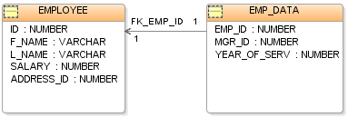

# Database Systems Overview

## 1. What database models do you know

---


---


---
Relational (table)



---


---

## 2. Which are the main functions performed by a Relational Database Management System (RDBMS)

- Relational Database Management Systems (RDBMS) manage data stored in tables
- RDBMS systems typically implement
  - Creating / altering / deleting tables and relationships between them (database schema)
  - Adding, changing, deleting, searching and retrieving of data stored in the tables
  - Support for the SQL language
  - Transaction management (optional)

---

## 3. Define what is "table" in database terms

- Database tables consist of data, arranged in rows and columns

Id | First Name | Last Name | Employer |
| :-: | :-: | :-: | :-: |
1 | Peter | Parker | Marvel |
2 | Bruce | Wayne | DC |
3 | Mickey | Mouse | Disney |

- All rows have the same structure
- Columns have name and type (number, string, date, image, or other)

---

## 4. Explain the difference between a primary and a foreign key

### Primary Key

The primary key of a relational table uniquely identifies each record in the table. It can either be a normal attribute that is guaranteed to be unique
(such as Social Security Number in a table with no more than one record per person) or it can be generated by the DBMS (such as a globally unique
identifier, or GUID, in Microsoft SQL Server). Primary keys may consist of a single attribute or multiple attributes in combination. Two records
(rows) are different if and only if their primary keys are different. The primary key can be composed by several columns (composite primary key).

### Foreign Key

In context of relational databases, a foreign key is a field (or collection of fields) in one table that uniquely identifies a row of another table.
In simpler words, the foreign key is defined in a second table, but it refers to the primary key in the first table. The table containing the foreign
key is called the child table, and the table containing the candidate key is called the referenced or parent table.

---

## 5. Explain the different kinds of relationships between tables in relational databases

- One-to-Many Relationship
  - A one-to-many relationship is the most common type of relationship. In this type of relationship,
  a row in table A can have many matching rows in table B, but a row in table B can have only one
  matching row in table A. For example, the publishers and titles tables have a one-to-many relationship:
  each publisher produces many titles, but each title comes from only one publisher. Make a one-to-many relationship if only one of the related columns is a primary
  key or has a unique constraint.
  The primary key side of a one-to-many relationship is denoted by a key symbol.
  The foreign key side of a relationship is denoted by an infinity symbol.
- Many-to-Many Relationships
  - In a many-to-many relationship, a row in table A can have many matching rows in table B, and vice versa.
  You create such a relationship by defining a third table, called a junction table, whose primary key consists
  of the foreign keys from both table A and table B. For example, the authors table and the titles table have a
  many-to-many relationship that is defined by a one-to-many relationship from each of these tables to the titleauthors table.
  The primary key of the titleauthors table is the combination of the au_id column (the authors table's primary key) and
  the title_id column (the titles table's primary key).
- One-to-One Relationships
  - In a one-to-one relationship, a row in table A can have no more than one matching row in table B, and vice versa.
  A one-to-one relationship is created if both of the related columns are primary keys or have unique constraints.

---

## 6. When is a certain database schema normalized

- Database normalization (or normalisation) is the process of organizing the columns (attributes) and tables (relations) of a relational database to minimize data redundancy.

---

## 7. What are database integrity constraints and when are they used

Constraints are part of a database schema definition.

A constraint is usually associated with a table and is created with a CREATE CONSTRAINT or CREATE ASSERTION SQL statement.

They define certain properties that data in a database must comply with. They can apply to a column, a whole table, more than one table or an entire schema.
A reliable database system ensures that constraints hold at all times (except possibly inside a transaction, for so called deferred constraints).

---

## 8. Point out the pros and cons of using indexes in a database

Without index on column user_name system would have to scan the entire Example table on a row-by-row basis to find all matching entries.
If the data distribution in particular table points that there are only a few rows or so this is clearly an inefficient way of obtaining those rows.

However, when using indexes, you are redirecting the power of search to a different, tree structure, that has faster lookups and very small depth.

- Constraints
  - You must have a primary key on the table with a unique value.
  - You cannot have any other indexes on the data.

## 9. What's the main purpose of the SQL language

Structured Language Query or simply SQL is a special-purpose programming language designed for managing data held in a relational database management system (RDBMS),
or for stream processing in a relational data stream management system (RDSMS).

---

## 10. What are transactions used for

A transaction symbolizes a unit of work performed within a database management system (or similar system) against a database, and treated in a coherent and reliable way
independent of other transactions. A transaction generally represents any change in database. Transactions in a database environment have two main purposes:

- To provide reliable units of work that allow correct recovery from failures and keep a database consistent even in cases of system failure, when execution stops
 (completely or partially) and many operations upon a database remain uncompleted, with unclear status.
- To provide isolation between programs accessing a database concurrently. If this isolation is not provided, the programs' outcomes are possibly erroneous.

### A simple explanation

You need to transfer 100$ from account A to account B. You can either do:

```
accountA -= 100;
accountB += 100;
```

or

```
accountB += 100;
accountA -= 100;
```

If something goes wrong between the first and the second operation in the pair you have a problem - either 100$ have disappeared or they have appeared out of nowhere.

A transaction is a mechanism that allows you to mark a group of operations and execute them in such a way thet either they all execute (commit) or the system state will be as
if they have not started to execute at all (rollback).

```
beginTransaction;
accountB += 100;
accountA -= 100;
commitTransaction;
```

will either transfer 100$ or leave both account in the initial state.

---

## 11. What is a NoSQL database

A NoSQL (originally referring to "non SQL" or "non relational") database provides a mechanism for storage and retrieval of data that is modeled in means other than the tabular
relations used in relational databases.

### NoSQL Database key "features"

- Use document-based model (non-relational)
- Schema-free document storage
- Still support CRUD operations(create, read, update, delete)
- Still support indexing and querying
- Still supports concurrency  and transactions
- Highly optimized for append / retrieve
- Great performance and scalability

---

## 12. Explain the classical non-relational data models

Document database expands on the basic idea of key-value stores where “documents” are more complex, in that they contain data and each document is assigned a unique key,
which is used to retrieve the document. These are designed for storing, retrieving, and managing document-oriented information, also known as semi-structured data.
Examples include: MongoDB and CouchDB.

---

## 13. Give few examples of NoSQL databases and their pros and cons

### There are four general types of NoSQL databases, each with their own specific attributes

- **Key-Value store** – we start with this type of database because these are some of the least complex NoSQL options. These databases are designed for storing data in a schema-less way.
 In a key-value store, all of the data within consists of an indexed key and a value, hence the name. Examples of this type of database include: Cassandra, DyanmoDB, Azure Table Storage (ATS), Riak, BerkeleyDB.
- **Column store** – (also known as wide-column stores) instead of storing data in rows, these databases are designed for storing data tables as sections of columns of data, rather than as rows
 of data. While this simple description sounds like the inverse of a standard database, wide-column stores offer very high performance and a highly scalable architecture. Examples include: HBase, BigTable and
 HyperTable.
- **Document database** – expands on the basic idea of key-value stores where “documents” are more complex, in that they contain data and each document is assigned a unique key, which is used to retrieve
 the document. These are designed for storing, retrieving, and managing document-oriented information, also known as semi-structured data. Examples include: MongoDB and CouchDB.
- **Graph database** – Based on graph theory, these databases are designed for data whose relations are well represented as a graph and has elements which are interconnected, with an undetermined number of
 relations between them. Examples include: Neo4J and Polyglot.

### The following table lays out some of the key attributes that should be considered when evaluating NoSQL databases

Datamodel       | Performance | Scalability     | Flexibility | Complexity | Functionality
----------------|-------------|-----------------|-------------|------------|-----------------
Key-value store | High        | High            | High        | None       | Variable (None)
Column Store    | High        | High            | Moderate    | Low        | Minimal
Document Store  | High        | Variable (High) | High        | Low        | Variable (Low)
Graph Database  | Variable    | Variable        | High        | High       | Graph Theory