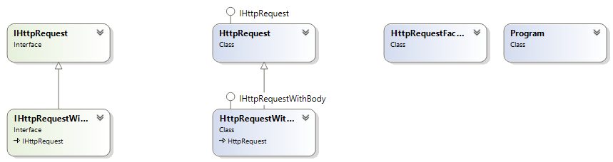

# Шаблони за създаване на обекти (Creational Patterns)

## Абстрактна Фабрика (Abstract Factory)

### Описание

Позволява създаването на сходни обекти (имащи близко предназначение) чрез
използване на интерфейс, без създаването им да се уповава на конкретен клас.

Този шаблон се използва при системи, които често се изменят.
Предоставя лесен и гъвкъв механизъм за замяна на конкретни групи от обекти.

### Имплементация


Абстрактна Фабрика

```csharp
public abstract class SmarthphoneFactory : ISmartphoneFactory
{
    public abstract IFlagmantSmartphone CreateFlagmantSmarthphone();

    public abstract IRegularSmartphone CreateRegularSmarthphone();
}

public class SamsungFactory : SmarthphoneFactory
{
    public override IFlagmantSmartphone CreateFlagmantSmarthphone()
    {
        return new SamsungFlagmantSmartphone();
    }

    public override IRegularSmartphone CreateRegularSmarthphone()
    {
        return new SamsungRegularSmartphone();
    }
}

public class LgFactory : SmarthphoneFactory
{
    public override IFlagmantSmartphone CreateFlagmantSmarthphone()
    {
        return new LgFlagmantSmartphone();
    }

    public override IRegularSmartphone CreateRegularSmarthphone()
    {
        return new LgRegularSmartphone();
    }
}
```

RegularSmarthphone и FlagmantSmarthphone класове

```csharp
public abstract class RegularSmarthphone : IRegularSmartphone
{
    public abstract void Camera();
}

public abstract class FlagmantSmarthphone : IFlagmantSmartphone
{
    public abstract void Display();
}
```

LG

```csharp
public class LgFlagmantSmartphone : FlagmantSmarthphone
{
    public override void Display()
    {
        Console.WriteLine("LG Display Quality");
    }
}

public class LgRegularSmartphone : RegularSmarthphone
{
    public override void Camera()
    {
        Console.WriteLine("LG Camera Quality");
    }
}
```

Samsung

```csharp
public class SamsungFlagmantSmartphone : FlagmantSmarthphone
{
    public override void Display()
    {
        Console.WriteLine("Samsung Display Quality");
    }
}

public class SamsungRegularSmartphone : RegularSmarthphone
{
    public override void Camera()
    {
        Console.WriteLine("Samsung Camera Quality");
    }
}
```

Buyer

```csharp
public class Buyer
{
    private ISmartphoneFactory smartphoneFactory;

    public Buyer(ISmartphoneFactory factory)
    {
        if (factory == null)
        {
            throw new ArgumentNullException();
        }

        this.smartphoneFactory = factory;
    }

    private IFlagmantSmartphone BuyFlagmantSmartphone()
    {
        return this.smartphoneFactory.CreateFlagmantSmarthphone();
    }

    private IRegularSmartphone BuyRegularSmartphone()
    {
        return this.smartphoneFactory.CreateRegularSmarthphone();
    }
}
```

---

## Сек (Singleton)

### Описание

Клас или обект, който гарантирано е един за изпъленение на цялата програма, за
целия й lifecycle. Не се извиква преди това и се извиква само веднъж.
Използва се тогава, когато цялото приложие трябва да достъпва този обект. Все
едно е глобален за програмата.

### Имплементация


```csharp
public class Logger
{
    private static Logger instance;

    private static object lockObject = new object();

    // създава се само и единствено от себе си
    private Logger()
    {

    }

    public static Logger Instance
    {
        get
        {
            // след първото създаване на instance, не се влиза повече в този if
            if (instance == null)
            {
                // локваме обекта, за да не може друга нишка да влезне
                // другите чакат и бавят приложението
                lock (lockObject)
                {
                    // lazy initialization
                    if (instance == null)
                    {
                        instance = new Logger();
                    }
                }
            }

            return instance;
        }
    }

    public void Log(string log)
    {
        System.Console.WriteLine(DateTime.Now + " " + log);
    }
}

public class Program
{
    static void Main()
    {
        Logger.Instance.Log("Singleton implemented");
    }
}
```

Имплементирайки по този начин Singleton(една инстанция през целия lifecycle),
Single Responsability принципа от SOLID е нарушен, защото Logger извиква себе си.
За да се избегне този проблем:

```csharp
public interface ILogger
{
    public ILog();
}

public class LoggerProvider
{
    public static ILogger GetLogger()
    {

    }
}
```

Проблемът обаче тук е, че може някой отново за извика GetLogger() и да създаде нова
инстанция.

Няма решение на проблема, преценява се кое е по-важното.

---

## Simple Factory

### Описание

Функция или обект, който служи за създаване на други обекти или функции. Ако искаме
да променим как даден обект се създава, само на едно място се променя логиката.
Лесно се добавят нови обекти или функции на едно място, останалата част от кода
работи по същия начин. Имплементира обекти, които имат някакъв общ интерфейс.
Ако се използва `new` навсякъде се couple към даден клас. Ако се използва Factory
се подава интерфейс, а factory прави нов обект - там се използва `new`

### Имплементация



```csharp
public interface IHttpRequest
{
    string Method { get; set; }

    string Url { get; set; }

    IDictionary<string, string> Headers { get; set; }
}

public interface IHttpRequestWithBody : IHttpRequest
{
    string Body { get; set; }

    string MimeType { get; set; }
}

public class HttpRequestWithBody : HttpRequest, IHttpRequestWithBody
{
    public HttpRequestWithBody(string method, string url, string[] customHeaders, string mimeType, string body)
        : base(method, url, customHeaders)
    {
        this.MimeType = mimeType;
        this.Body = body;
    }

    public string Body { get; set; }

    public string MimeType { get; set; }

    public override string ToString()
    {
        return "HTTP Request With Body";
    }
}

public class HttpRequest : IHttpRequest
{
    public HttpRequest(string method, string url, string[] customHeaders)
    {
        this.Method = method;
        this.Url = url;
        this.Headers = new Dictionary<string, string>();

        if (customHeaders != null)
        {
            for (int i = 0; i < customHeaders.Length; i += 2)
            {
                this.Headers.Add(customHeaders[i], customHeaders[i + 1]);
            }
        }
        }

    public IDictionary<string, string> Headers { get; set; }

    public string Method { get; set; }

    public string Url { get; set; }

    public override string ToString()
    {
        return "HTTP Request";
    }
}

public class HttpRequestFactory
{
    public static IHttpRequest CreateRequest(string method, string url, string[] customHeaders = null, string mimeType = "*/*", string body = "")
    {
        if (new string[] { "get", "options" }.Contains(method))
        {
            return new HttpRequest(method, url, customHeaders);
        }

        return new HttpRequestWithBody(method, url, customHeaders, mimeType, body);
    }
}
```