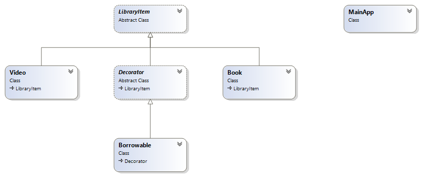

# Структурни шаблони (Structural Patterns)

## Декоратор (Decorator)

### Описание

Декоратор е структорен шаблон за разработка. Използва се когато е необходимо да
се добави допълнителна функционалност към отделен обект (инстанция на клас),
независимо дали статично или динамично, без това да влияе на останалите инстанции
от същият клас. Това се постига чрез създаването на нов декоратор клас, който
обвива оригиналният клас. Този шаблон е проектиран по такъв начин, че множество
декоратои могат да се наслоят един върху друг, като всеки път се добавя нова фунцкионалност.
Този шаблон е алтернатива на subclassing, който добавя фунцкионалност на всички
инстанции на оригиналния клас, докато декоратора, добавя функционалност само на индивидуални
обекти. Входно/Изходните потоци в .NET Framework използват този шаблон.

### Имплементация




```csharpharp
internal class MainApp
{
	private static void Main()
	{
		Book book = new Book("Worley", "Inside ASP.NET", 10);
		book.Display();

		Video video = new Video("Spielberg", "Jaws", 23, 92);
		video.Display();

		Console.WriteLine("\nMaking video borrowable:");

		Borrowable borrowvideo = new Borrowable(video);
		borrowvideo.BorrowItem("Customer #1");
		borrowvideo.BorrowItem("Customer #2");

		borrowvideo.Display();

		Console.ReadKey();
	}
}

internal abstract class LibraryItem
{
	private int numCopies;

	public int NumCopies
	{
		get { return numCopies; }
		set { this.numCopies = value; }
	}

	public abstract void Display();
}

internal class Book : LibraryItem
{
	private string author;
	private string title;

	public Book(string author, string title, int numCopies)
	{
		this.author = author;
		this.title = title;
		this.NumCopies = numCopies;
	}

	public override void Display()
	{
		Console.WriteLine("\nBook ------ ");
		Console.WriteLine(" Author: {0}", this.author);
		Console.WriteLine(" Title: {0}", this.title);
		Console.WriteLine(" # Copies: {0}", this.NumCopies);
	}
}

internal class Video : LibraryItem
{
	private string director;
	private string title;
	private int playTime;

	public Video(string director, string title,
	int numCopies, int playTime)
	{
		this.director = director;
		this.title = title;
		this.NumCopies = numCopies;
		this.playTime = playTime;
	}

	public override void Display()
	{
		Console.WriteLine("\nVideo ----- ");
		Console.WriteLine(" Director: {0}", director);
		Console.WriteLine(" Title: {0}", title);
		Console.WriteLine(" # Copies: {0}", NumCopies);
		Console.WriteLine(" Playtime: {0}\n", playTime);
	}
}

internal abstract class Decorator : LibraryItem
{
	protected LibraryItem libraryItem;

	public Decorator(LibraryItem libraryItem)
	{
		this.libraryItem = libraryItem;
	}

	public override void Display()
	{
		libraryItem.Display();
	}
}

internal class Borrowable : Decorator
{
	protected List<string> borrowers = new List<string>();

	public Borrowable(LibraryItem libraryItem)
: base(libraryItem)
	{
	}

	public void BorrowItem(string name)
	{
		borrowers.Add(name);
		libraryItem.NumCopies--;
	}

	public void ReturnItem(string name)
	{
		borrowers.Remove(name);
		libraryItem.NumCopies++;
	}

	public override void Display()
	{
		base.Display();

		foreach (string borrower in borrowers)
		{
			Console.WriteLine(" borrower: " + borrower);
		}
	}
}
```

---

## Композиция (Composite)

### Описание

Composite Pattern-ът е шаблон, който се използва в обектно-ориентираното програмиране.
Той ни позволява да създаваме йерархия от класове, като ги комбинираме в дървовидна
структура.Също така, ни позволява да третираме простите обкети (листата) и композитните
обекти по един и същи начин.

### Имплементация


```csharp
internal class Program
    {
        private static void Main(string[] args)
        {
            var compositeGraphic = new CompositeGraphic();
            var compositeGraphic1 = new CompositeGraphic();
            var compositeGraphic2 = new CompositeGraphic();

            compositeGraphic1.Add(new Ellipse());

            compositeGraphic2.AddRange(new Ellipse(),
                new Ellipse());

            compositeGraphic.AddRange(new Ellipse(),
                compositeGraphic1,
                compositeGraphic2);

            compositeGraphic.Print();
            Console.ReadLine();
        }
    }

    public interface IGraphic
    {
        void Print();
    }

    public class Ellipse : IGraphic
    {
        public void Print()
        {
            Console.WriteLine("Ellipse");
        }
    }

    public class CompositeGraphic : IGraphic
    {
        private readonly List<IGraphic> graphics;

        public CompositeGraphic()
        {
            graphics = new List<IGraphic>();
        }

        public void Add(IGraphic graphic)
        {
            graphics.Add(graphic);
        }

        public void AddRange(params IGraphic[] graphic)
        {
            graphics.AddRange(graphic);
        }

        public void Delete(IGraphic graphic)
        {
            graphics.Remove(graphic);
        }

        public void Print()
        {
            foreach (var childGraphic in graphics)
            {
                childGraphic.Print();
            }
        }
    }
```

---

## Адаптер (Adapter)

### Описание

Шаблонът за дизайн "Adapter Pattern" подбира членове-променливи от класове с различни
интерфейси.

Този шаблон е често използван и лесен за имплементация, изключително удобен при работа
с класове, които имат несъвместими интерфейси.

### Имплементация


Класът TradingDataImporter симулира клиентско поведение с интерфейс Connector.

```csharp
	public class TradingDataImporter
    {
        public void ImportData(Connector connector)
        {
            connector.GetData();
        }
    }
```

Абстрактният клас Adapter дефинира интерфейса, който клиента познава и с който може
да работи.
Конкретните Adapter класове интерфейса на несъвместими класове в интерфейс, който
клиента
разпознава. Те позволяват на несъвместими интерфейси да работят заедно въпреки
очевидните различия помежду им.

```csharp
    public abstract class Connector
    {
        public abstract void GetData();
    }
 
    public class DatabaseConnector : Connector
    {
        public override void GetData()
        {
            var databaseHelper = new DatabaseHelper();
            databaseHelper.QueryForChanges();
        }
    }
 
    public class XmlFileConnector : Connector
    {
        public override void GetData()
        {
            var xmlfileLoader = new XmlFileLoader();
            xmlfileLoader.LoadXML();
        }
    }
 
    public class HttpStreamConnector : Connector
    {
        public override void GetData()
        {
            var websiteScanner = new WebSiteScanner();
            websiteScanner.Scan();
        }
    }
```

По-долу е даден пример с различни Adapter класове, които имплементират различни интерфейси.
Клиентът от своя страна очаква шаблонен интерфейс, който тези класове не предоставят.
Ето защо те биват манипулирани от конкретните Adapter класове, за да ги направят
съвместими с клиента.

```csharp
	public class DatabaseHelper
    {
        public void QueryForChanges()
        {
            Console.WriteLine("Database queried.");
        }
    }
 
    public class WebSiteScanner
    {
        public void Scan()
        {
            Console.WriteLine("Web sites scanned.");
        }
    }
 
    public class XmlFileLoader
    {
        public void LoadXML()
        {
            Console.WriteLine("Xml files loaded.");
        }
    }
```

+ В последната стъпка е добавен код, който тества софтуерния дизайн на шаблона.

```csharp
	public static void Adapter()
    {
        var tradingdataImporter = new TradingDataImporter();
 
        Connector databaseConnector = new DatabaseConnector();
        tradingdataImporter.ImportData(databaseConnector);
 
        Connector xmlfileConnector = new XmlFileConnector();
        tradingdataImporter.ImportData(xmlfileConnector);
 
        Connector httpstreamConnector = new HttpStreamConnector();
        tradingdataImporter.ImportData(httpstreamConnector);
 
        Console.ReadKey();
    }
```