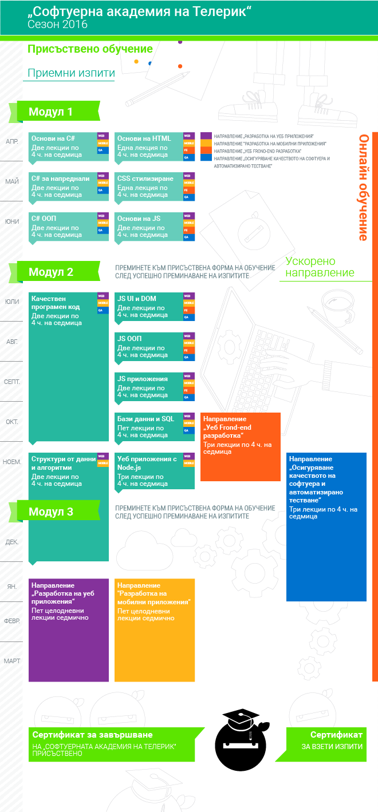

# Telerik Software Academy

---

| Month | Module | Subject | Telerik | Homework | Exam Preparation |
| :-: | :-: | :-: | :-: | :-: | :-: | :-: |
| April | 1 |  [C# Basics](https://telerikacademy.com/Courses/Courses/Details/323) | [GitHub](https://github.com/TelerikAcademy/CSharp-Part-1) \ [About](http://academy.telerik.com/student-courses/programming/csharp-programming-part-1/about)| [GitHub](./Module-1/CSharp-Part-1) | [GitHub](./Module-1/CSharp-Part-1/07-Exam-Preparation) |
| April | 1 | [HTML Basics](https://telerikacademy.com/Courses/Courses/Details/324) | [GitHub](https://github.com/TelerikAcademy/HTML) \ [About](http://academy.telerik.com/student-courses/web-design-and-ui/html-fundamentals/about) | [GitHub](./Module-1/HTML) | [GitHub](./Module-1/HTML/06-Exam-Preparation) |
| May | 1 | [C# Advanced](https://telerikacademy.com/Courses/Courses/Details/331) | [GitHub](https://github.com/TelerikAcademy/CSharp-Part-2) \ [About](http://academy.telerik.com/student-courses/programming/csharp-programming-part-2/about) | [GitHub](./Module-1/CSharp-Part-2) | [GitHub](./Module-1/CSharp-Part-2/Exam-Preparation) |
| May | 1 | [CSS Styling](https://telerikacademy.com/Courses/Courses/Details/332) | [GitHub](https://github.com/TelerikAcademy/CSS) \ [About](http://academy.telerik.com/student-courses/web-design-and-ui/css-styling/about)| [GitHub](./Module-1/CSS/Homework) | [GitHub](./Module-1/CSS/Exam-Preparation) |
| June | 1 | [Object Oriented Programming](https://telerikacademy.com/Courses/Courses/Details/338) | [GitHub](https://github.com/TelerikAcademy/Object-Oriented-Programming) \ [About](http://academy.telerik.com/student-courses/programming/object-oriented-programming/about) | [GitHub](./Module-1/OOP/Homework) | [GitHub](./Module-1/OOP/Exam-Preparation) |
| June | 1 | [JavaScript-Fundamentals](https://telerikacademy.com/Courses/Courses/Details/339) | [GitHub](https://github.com/TelerikAcademy/JavaScript-Fundamentals) \ [About](http://academy.telerik.com/student-courses/web-design-and-ui/javascript-fundamentals/about) | [GitHub](./Module-1/JavaScript-Fundamentals/Homework) | [GitHub](Module-1/JavaScript-Fundamentals/Exam-Preparation) |
| July | 2 | [JavaScript UI и DOM](https://telerikacademy.com/Courses/Courses/Details/344) | [GitHub](https://github.com/TelerikAcademy/JavaScript-UI-and-DOM) \ [About](http://academy.telerik.com/student-courses/web-design-and-ui/javascript-ui-dom/about) | [GitHub](./Module-2/JavaScript-UI-and-DOM/Homework) | [GitHub](./Module-2/JavaScript-UI-and-DOM/Exam-Preparation) |
| July | 2 | [Unit Testing](https://telerikacademy.com/Courses/Courses/Details/345) | [GitHub](https://github.com/TelerikAcademy/High-Quality-Code-Unit-Testing) \ [About](http://academy.telerik.com/student-courses/programming/high-quality-code/about) | [GitHub](./Module-2/Unit-Testing/Homework) | [GitHub](./Module-2/Unit-Testing/Exam-Preparation) |
| August | 2 | [High Quality Code Part 1](https://telerikacademy.com/Courses/Courses/Details/347) | [GitHub](https://github.com/TelerikAcademy/High-Quality-Code-Part-1) \ [About](http://academy.telerik.com/student-courses/programming/high-quality-code-part-1/about) | [GitHub](./Module-2/HQC-Part-1/Homework) | N/A |
| August | 2 | [JavaScript OOP](https://telerikacademy.com/Courses/Courses/Details/346) | [GitHub](https://github.com/TelerikAcademy/JavaScript-OOP) \ [About](http://academy.telerik.com/student-courses/web-design-and-ui/javascript-oop/about) | [GitHub](./Module-2/JavaScript-OOP/Homework) | [GitHub](./Module-2/JavaScript-OOP/Exam-Preparation) |
| September | 2 | [High Quality Code Part 2](https://telerikacademy.com/Courses/Courses/Details/349) | [GitHub](https://github.com/TelerikAcademy/High-Quality-Code-Part-2) \ [About](http://academy.telerik.com/student-courses/programming/high-quality-code-part-2/about) | [GitHub](./Module-2/HQC-Part-2/Homework) | N/A |
| September | 2 | [JavaScript Applications](https://telerikacademy.com/Courses/Courses/Details/350) | [GitHub](https://github.com/TelerikAcademy/JavaScript-Applications) \ [About](http://academy.telerik.com/student-courses/web-design-and-ui/javascript-applications/about) | [GitHub](./Module-2/JavaScript-Applications/Homework) | [GitHub](./Module-2/JavaScript-Applications/Exam-Preparation) |
| October | 2 | [Databases](https://telerikacademy.com/Courses/Courses/Details/388) | [GitHub](https://github.com/TelerikAcademy/Databases) \ [About](http://academy.telerik.com/student-courses/software-technologies/databases/about) | [GitHub](./Module-2/Databases/Homework) | GitHub |
| October | 2 | [Design Patterns](https://telerikacademy.com/Courses/Courses/Details/389) | [GitHub](https://github.com/TelerikAcademy/Design-Patterns) \ About | [GitHub](./Module-2/Design-Patterns/Homework) | GitHub |

---

